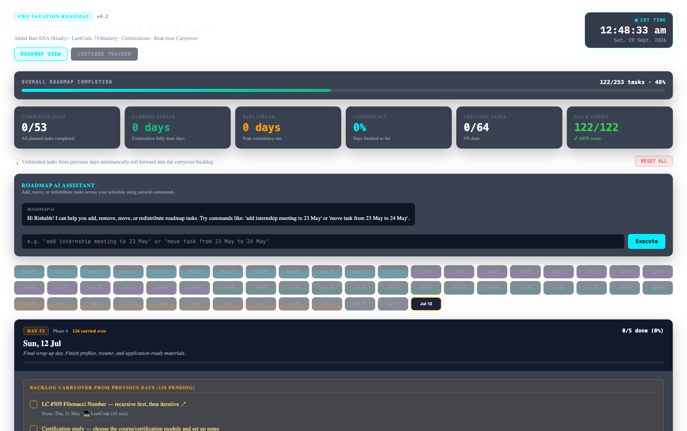
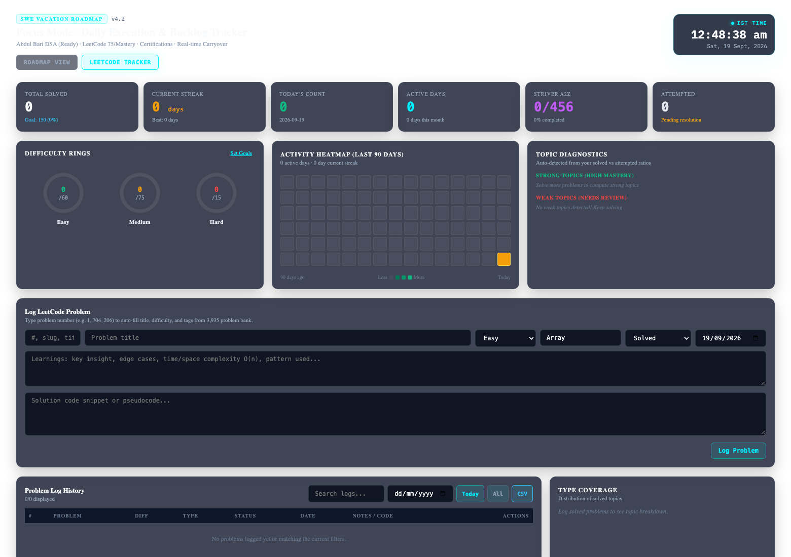

# SWE Placement Sprint & Daily Focus Roadmap

> **A battle-tested daily execution roadmap, backlog carryover engine, and comprehensive LeetCode analytics dashboard built to prepare for college software engineering campus placements.**

[](https://react.dev/)
[](https://vitejs.dev/)
[](https://eslint.org/)
[](#curriculum--phase-breakdown-may-21--july-12-2026)
[](LICENSE)

---

## Context & Motivation

I built this personal command center to structure and dominate my **college placement season preparation** during my college semester break (**May 21, 2026 – July 12, 2026**, 53 consecutive days). 

Preparing for software engineering campus placements requires balancing multiple demanding tracks simultaneously:
- Deep Data Structures & Algorithms conceptual clarity (Abdul Bari algorithms course)
- Consistent, high-frequency LeetCode problem solving
- Core computer science fundamentals (OS, DBMS, CN, OOP) and Cloud/System Certifications
- Active software engineering internship deliverables
- Resume tailoring, GitHub portfolio projects, and mock interview practice

Spreadsheets and static checklist apps quickly fell short because **tasks invariably slip** when coursework or internship deadlines hit. This app was built around a first-principles rule: **no task is ever lost**. Any unfinished task automatically rolls forward into the live carryover backlog until completed.

---

## Screenshots

### 1. Daily Execution & Real-Time Carryover Roadmap
The main dashboard displays daily phase objectives, priority controls, completion stats, and the active carryover backlog.



### 2. LeetCode Mastery & Analytics Dashboard
Deep analytics tracker featuring a 90-day activity contribution heatmap, streak tracker, difficulty donut rings, topic diagnostics, and an instant search bank of 3,935+ problems.



---

## Key Features

### 1. 53-Day Daily Execution Engine
- **Curated 4-Phase Curriculum**: 252 structured tasks organized across 53 days with zero artificial filler.
- **Dynamic Carryover Backlog**: Missed tasks from past days automatically accumulate into a dedicated carryover backlog until resolved.
- **Priority Tags**: Assign High, Medium, or Low priority badges to individual tasks or entire day sections.
- **Roadmap AI Assistant**: Natural language input bar allowing you to schedule, shift, or redistribute tasks across days (e.g., `"move task from 23 May to 24 May"`).
- **Extensible Workflows**: Add custom tasks and extra practice problems to any day on the fly with automatic local persistence.

### 2. DSA Foundation & Placement Profile Audits
- **122 Foundational DSA Tasks Marked Ready**: Pre-mapped to Abdul Bari algorithms course, recursion, linked lists, trees, graphs, sorting, and STL sprints (`READY (Udemy)`).
- **21 Placement Profile & Application Audits Marked Done**: All resume reviews, LinkedIn polish, GitHub repo showcases, cover letter prep, and profile audits are pre-cleared (`AUDITED`).
- **Intelligent Carryover Filtering**: Foundational courses and completed profile audits never clutter the pending carryover backlog.

### 3. Full-Spectrum LeetCode Analytics Dashboard
- **Comprehensive Problem Bank**: Instant $O(1)$ search and auto-complete across **3,935 LeetCode problems** (944 Easy, 2,057 Medium, 934 Hard).
- **Interactive 90-Day Contribution Heatmap**: Visual GitHub-style activity grid displaying solve consistency, streak intensity, and date tooltips.
- **SVG Progress Donut Rings**: Live progress rings for Easy (`#10B981`), Medium (`#F59E0B`), and Hard (`#EF4444`) compared against personal targets.
- **Streak & Consistency Metrics**: Real-time tracking of active streaks, peak streak records, active days this month, and daily targets.
- **Weak & Strong Topic Diagnostics**: Evaluates your solve distribution across dynamic programming, trees, graphs, heaps, two pointers, etc., automatically flagging topics that need revision.
- **Custom Goal Targets (`lc_goals_v2`)**: Configurable daily, weekly, and monthly problem targets.
- **Striver A2Z Reference Integration**: Complete 456-problem reference sheet with local tracking, isolated from the daily roadmap to prevent backlog fatigue.
- **1-Click CSV Export**: Instant backup of all solved problems, notes, code snippets, and timestamps.

### 4. High-Performance Cyber-Dark UI
- **Zero-Lag Architecture**: Root re-renders caused by 1-second clock ticks were decoupled into an isolated `<LiveClock />` component.
- **Stitch-Inspired Cyber-Dark Theme**: Built with custom CSS design tokens, neon cyberpunk accents (`#00F0FF`, `#BF5AF2`, `#30D158`), JetBrains Mono typography, and smooth responsive layouts (up to 1560px).
- **Deep Linking**: Switch between views directly using URL parameters (e.g. `/?tab=roadmap` or `/?tab=leetcode`).

---

## Curriculum & Phase Breakdown (May 21 – July 12, 2026)

| Phase | Timeline | Focus Area | Total Tasks | DSA Ready | Profile Audited | Active Backlog |
| :--- | :--- | :--- | :---: | :---: | :---: | :---: |
| **Phase 1** | May 21 – Jun 1 | **Foundations**: Recursion, Arrays, Math, Two Pointers, Linked Lists | 74 | 46 | 0 | **28** |
| **Phase 2** | Jun 2 – Jun 15 | **Linear Structures & Trees**: Stacks, Queues, Binary Trees, BSTs | 56 | 28 | 0 | **28** |
| **Phase 3** | Jun 16 – Jun 29 | **Hashing, STL & Sorting**: Hash Maps, Heap/Priority Queue, Sorting Algorithms | 61 | 28 | 0 | **33** |
| **Phase 4** | Jun 30 – Jul 12 | **Graphs, Projects & Placement Sprint**: Graph traversals, Portfolio build, Final review | 61 | 20 | 21 | **20** |
| **Total** | **53 Days** | | **252** | **122** | **21** | **109** |

### Active Backlog Categories (109 Tasks)
- **LeetCode Practice (64 tasks)**: High-yield placement problems (LC Top 75 / Blind 75 / Company-tagged).
- **Cloud & Systems Certifications (18 tasks)**: AWS / GCP / Oracle cloud preparation and mock test series.
- **Internship Deliverables (13 tasks)**: Core feature implementation, documentation, and pull requests.
- **Revision & Checkpoints (6 tasks)**: Scheduled spaced repetition and problem revisit sessions.
- **Applied AI / Projects (4 tasks)**: Applied AI engineering project sprint and evaluation.
- **Project Wrap-Up & College Prep (4 tasks)**: Final code notes, wrap-up doc, and next semester planning.

---

## Tech Stack & Architecture

- **Framework**: [React 19](https://react.dev/) with functional components and modern hooks (`useMemo`, `lazy`, `Suspense`)
- **Bundler & Tooling**: [Vite 8](https://vitejs.dev/) with hot module replacement (HMR) and fast build output
- **Linting & Code Quality**: ESLint with strict React Hooks rules (`0 errors, 0 warnings`)
- **Styling**: Vanilla CSS with custom theme variables, custom scrollbars, and responsive grid/flexbox layouts
- **State & Storage**: Browser `localStorage` with backward-compatible schema versioning (`STORAGE_KEY`, `lc_logs_v1`, `lc_goals_v2`, `striver_a2z_progress_v1`)
- **Offline First**: Entirely client-side with no external database dependencies. Cold start in under 100ms.

---

## Getting Started

### Prerequisites
- [Node.js](https://nodejs.org/) (version 18.0.0 or higher recommended)
- `npm` (bundled with Node)

### Installation

1. **Clone the repository**:
   ```bash
   git clone https://github.com/RJ1899157/roadmap-app.git
   cd roadmap-app
   ```

2. **Install dependencies**:
   ```bash
   npm install
   ```

3. **Start the local development server**:
   ```bash
   npm run dev
   ```
   Open [http://localhost:5173](http://localhost:5173) in your browser.

4. **Deep Links**:
   - Roadmap View: `http://localhost:5173/?tab=roadmap`
   - LeetCode Tracker: `http://localhost:5173/?tab=leetcode`

### Build & Production Preview

```bash
# Verify linting
npm run lint

# Compile optimized production bundle
npm run build

# Preview production build locally
npm run preview
```

---

## Repository Structure

```
roadmap-app/
├── public/
│   ├── leetcode-problems.json   # 3,935 indexed LeetCode problems (metadata & topics)
│   └── striver-a2z-sheet.json   # 456 curated Striver A2Z problems
├── screenshots/
│   ├── roadmap-view.png         # Screenshot of Roadmap & Carryover view
│   └── leetcode-view.png        # Screenshot of LeetCode Dashboard
├── src/
│   ├── components/
│   │   └── LiveClock.jsx        # Isolated HUD clock preventing app re-renders
│   ├── data/
│   │   └── roadmapData.js       # Curriculum data, phase pipelines & carryover helpers
│   ├── App.jsx                  # Main Roadmap Dashboard & Focus Mode view
│   ├── LeetCodeDashboard.jsx    # LeetCode analytics, heatmap & logs dashboard
│   ├── index.css                # Cyber-dark theme tokens, animations & layout
│   └── main.jsx                 # React root mount
├── package.json
├── vite.config.js
└── README.md
```

---

## License

Distributed under the MIT License. See [LICENSE](LICENSE) for more information.

---

## Acknowledgments

- **Abdul Bari** for his unmatched Data Structures & Algorithms lectures.
- **LeetCode** and the competitive programming community for curated problem sets.
- Built with dedication for software engineering placements.
